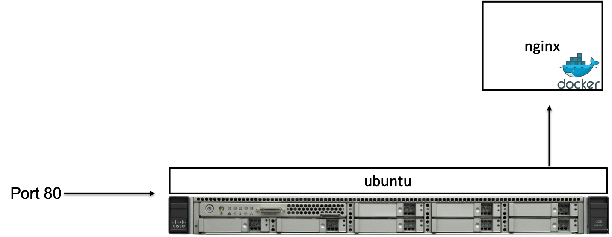
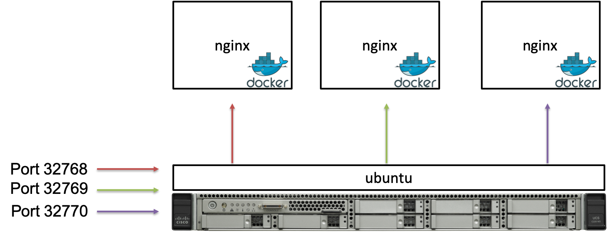
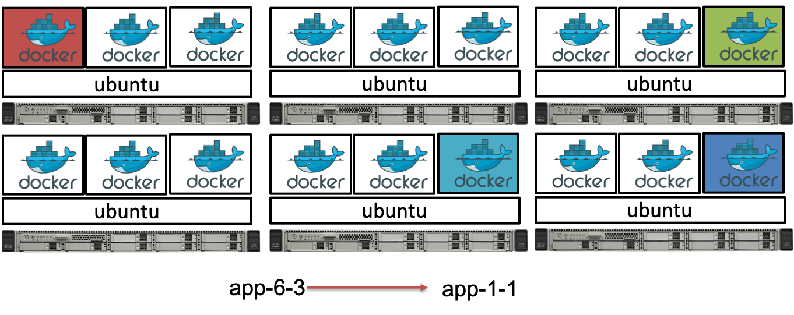

# Containers: Why the hype? 

Imagine the following play based on true life events before using containers: 

* `Developer:` Here is the is application that is ready to go into production.  I wrote it in python, just run it in production now!
* `Operations:` Ok, that sounds easy enough.  Let's see, just put it here in python and ... hey, its complaining about missing a library?  I can't tell what is wrong here...
* `Developer:` Ah, that's right!  You need the OpenCV library for this to work. 
* `Operations:` /grumble grumble... Ok, I got it installed, OpenCV but.. wait... It doesn't work.  Complains about something?  I can't tell, can you help me out? 
* `Developer:` Oh!  Forgot about that, the 3.0.1 version doesn't work. You have to use the 3.0.0 version as the bug doesn't exist there.  You know how open source software goes! Always an adventure!
* `Operations:` Ok, got the right version!  Should start now and... Gah!  It still doesn't run. What is wrong?  I've done everything I could!  Still doesn't work.  Have you tested this code? 
* `Developer:` So sorry, let me see.  It does run for me in my environment just fine... Ah, ok, I see, you are running with Python2.7.  This code is written for Python 3.8. 

And that is how the world worked getting things into production before.  Now realize that the app will change, faster than before and that these changes may bring new libraries and new environments.  Docker changes all that.  If we make the developer in charge of creating the docker container, or we as operations people give the developer the base containers we expect them to use then all the problems of [dependency hell](https://en.wikipedia.org/wiki/Dependency_hell) goes away. 

So containers are great and make our lives easier to reduce the friction required in getting development code into production.  Docker, then is lube for our data center. 

## Challenges with Docker

But like any solution, it brings with it tradeoffs and side effects.  With Docker, we now have some other issues.  To illustrate this, let's start with a simple example of running one container on a server: 

```
docker run -d -p 80:80 nginx
```


This server can be virtual or physical, or even your laptop.  If a person enters the IP address of the server into the browser they'll see the default nginx webpage that is created from the container. No problem here!  Docker works just fine. 

### A little more difficult

But let's make things a little more complicated: 

```
for i in $(seq 3); do docker run -d -P nginx; done
```


Here we have to use the `-P` flag because our server only has one port 80.  So docker assigns random ports (32768-3270) to the 3 containers we launched.  This still isn't bad. But now we have to remember which ports are being used.  We can set up another nginx server that is a reverse proxy to funnel traffic to these three containers and load balance between them.  That even allows us to do A/B testing fairly easy.  As long as our load isn't too bad, this is a cool solution!

But there are still problems with this:  

1. The ports will change as a container is stopped and restarted. 
2. The reverse proxy will have to be updated to reflect the change in the port. 
3. We should probably spread the load among more than one machine to make things more resiliant. 

Even with these few issues, this is a completely workable solution.  If we don't have a lot of load we can surely handle this pretty well.  But life, is usually a little more complicated than that. 
 
### Even more difficult

Let's suppose we have 6 machines and 18 different applications.  They all happen to be named `app${i}-${j}` where `i` is the server number and `j` is the application number.  We can launch these on our cluster of 6 servers with some simple bash foo: 

```
for i in $(seq 6); do for j in $(seq 3); do ssh node0$i docker run –d -P app${i}-${j}; done; done
```
We then get something like the following picture: 



Ok, this is rediculous.  Now we have a bunch of unknown ports as well as issues knowing which server our application is running on. 

To further complicate this, imagine app-6-3 is dependent upon app-1-1. (e.g: app-1-1 is a MariaDB database).  How will app-6-3 find it?  How will it adapt if app-1-1 needs to be restarted and the port changes? 

So we have a few problems: 

* How do we keep track of which port goes to which container on which host? 
* How can we efficiently allocate containers to hosts?  Not all apps use the resources as much.  We could have 30 containers on one host using less resources than 4 containers on another host.  We need a way to bin pack. 
* Microservices scale horizontally so how do we map service dependencies?  What if the MariaDB is a cluster of servers, how can we keep a consistent host name for the dependency when services go down? 
* Applications are frequently updated, ports are randomized, how do we account for all these frequent changes? 

And as such, several solutions have emerged. Docker Datacenter (no longer available), AWS ECS, Hashicorp Nomad,...

## The Kubernetes solution 

In 2015, Google [released a paper detailing how it does large scale cluster management with containers. ](https://research.google/pubs/pub43438/)
The paper outlined lessons learned and how those lessons learned were put into Kubernetes. (section 8 in the paper)

Kubernetes has built in mechanisms to solve all of the problems mentioned above. These solutions are as follows: 

* The kubelet communicates with the Kubernetes controller to track the ports used on each host of the container.  This information is stored in `etcd`.
* Containers are allocated using a Kubernetes scheduler which uses an agent on the nodes (the kubelet) to determine load. 
* Kubernetes has the idea of a [service](https://kubernetes.io/docs/concepts/services-networking/service/) that is a virtual IP of the underlying containers that make up the service.  As new pods (containers) change, the labels direct the virtual IP to the service. 
* Kubernetes has it's own service discovery with [kubeDNS](https://kubernetes.io/docs/concepts/services-networking/dns-pod-service/)

These and more issues are baked into Kubernetes.  When I first started using Mesos with Marathon we didn't have service discovery so we had to use Hashicorp Consul to do this.  That is 3 different open source projects!  Kubernetes bakes it all in together and even includes things like ingress controllers and custom resource definitions to extend the cluster.  We'll show all of these as we go along. 